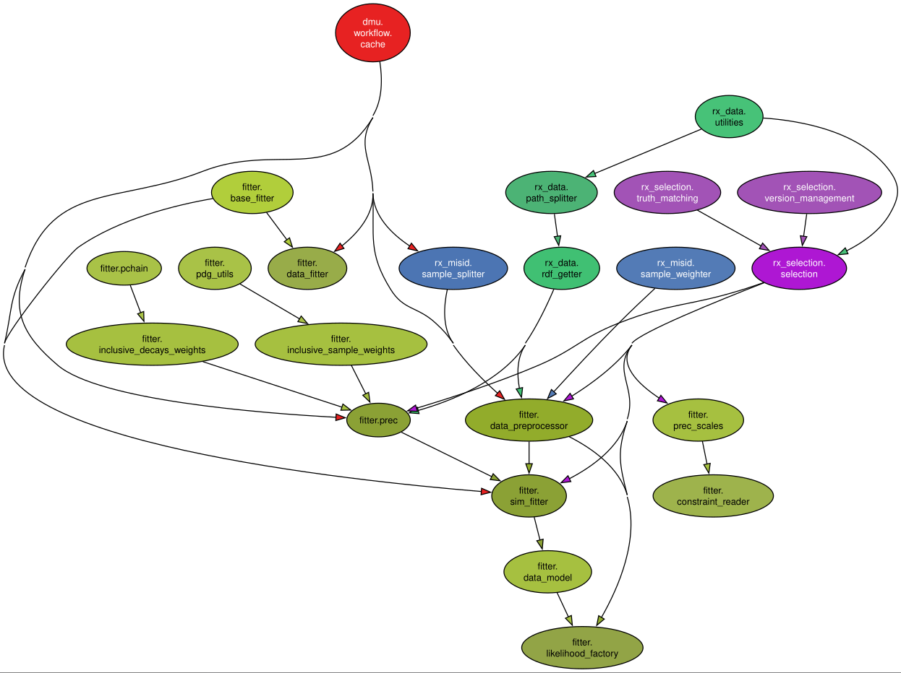

# Fitter

This project is meant to automate:

- Building of models
- Fits to MC 
- Fits to data
- Creation of validation plots, tables, etc
- Application of constraints
- Obtention of fitting information, specially:
    - Mass scales, resolutions
    - Signal yields for resonant and rare modes

And be used as an input for:

- Systematics evaluation
- Extraction of $R_K$ and $R_K^*$
- Calibrations

Ideally with minimal changes for new observables.
The class is organized as in the diagram below:



This project makes heavy use of caching through the [Cache](https://github.com/acampove/dmu?tab=readme-ov-file#caching-with-a-base-class)
class and thus:

- It allows for fast reruns
- It allows for the fitters to also be used to retrieve parameters

## Usage

For fits to data do:

```bash
fit_rx_data -c rare/electron -q central -C 0.5 -P 0.5
```

to use the configuration in `src/fitter_data/rare/electron/data.yaml`
with an MVA working point of `0.5` for the combinatorial and part reco BDTs.

This should:

- Apply the selection on the MC and data
- Fit the MC
- Use the MC to create components for the fit to the data
- Fit the data and save everything

To do the same from a python script do:

```python
from dmu.generic        import utilities  as gut
from rx_selection       import selection  as sel
from fitter.data_fitter import DataFitter

cfg = gut.load_conf(
    package='fitter_data',
    fpath  ='rare/electron/data.yaml')

with sel.custom_selection(d_sel={
        'nobr0' : 'nbrem != 0',
        'bdt'   : 'mva_cmb > 0.60 && mva_prc > 0.40'}):
    ftr = DataFitter(
        sample = 'DATA_24_*',
        trigger= 'Hlt2RD_BuToKpEE_MVA',
        project= 'rx',
        q2bin  = 'central',
        cfg    = cfg)
    obj = ftr.run()
```

where `obj` is a `DictConf` (from the `omegaconf` project) dictionary where the
parameters and errors can be accessed as:

```python
val = obj['name']['value']
err = obj['name']['error']
```

